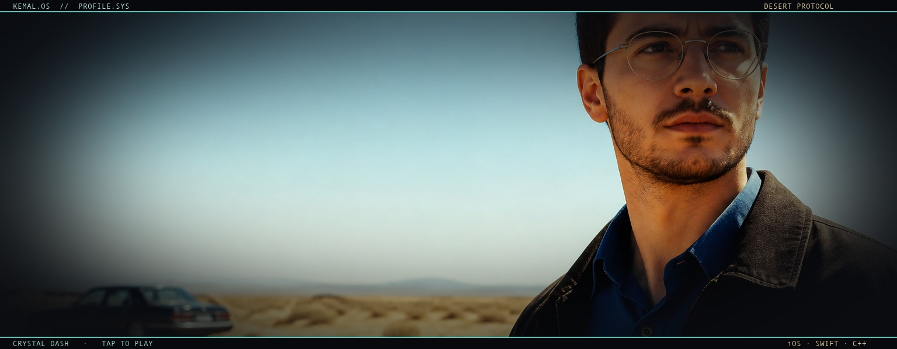
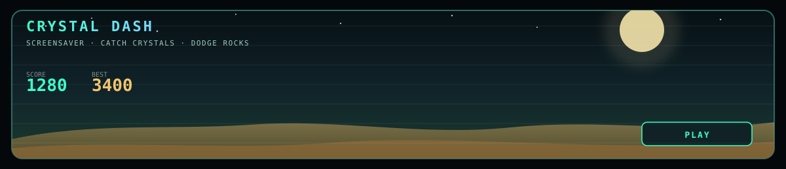

<p align="center">
  <a href="https://kemalzeitulaev.github.io/kemalzeitulaev/">
    
  </a>
  <a href="https://kemalzeitulaev.github.io/kemalzeitulaev/">
    
  </a>
</p>

<p align="center">
  <a href="https://kemalzeitulaev.github.io/kemalzeitulaev/"><b>▶ PLAY CRYSTAL DASH</b></a>
</p>

<h1 align="center">Kemal Zeitulaev</h1>
<p align="center">
  <b>iOS developer</b> · Swift, C++ и Python<br/>
  Приложения, архитектура и немного пустынного вайба
</p>

<p align="center">
  <a href="https://kemalzeitulaev.github.io/kemalzeitulaev/">
    
  </a>
  
  
  
  
</p>

---

### привет

Меня зовут **Kemal**. Я iOS-разработчик: собираю приложения, думаю про архитектуру и люблю, когда интерфейс выглядит как сцена, а не как анкета.

Сейчас в фокусе — мобильные продукты про заботу и здоровье, плюс классика: Swift, C++ и Python.

<br/>

### стек

```text
language   Swift · C++ · Python
apple      UIKit · SwiftUI · Combine
arch       MVVM · Clean · SPM
tools      Xcode · Git · REST
```

<br/>

### проекты

| репозиторий | о чём |
|---|---|
| [CareMom](https://github.com/kemalzeitulaev/CareMom) | приложение для мам |
| [MedNotAi](https://github.com/kemalzeitulaev/MedNotAi) | AI-заметки для медицины |
| [Aip](https://github.com/kemalzeitulaev/Aip) | текущий эксперимент |
| [labABC](https://github.com/kemalzeitulaev/labABCKemalZeitulaev-i-2-25) | C++ лабораторные |

<br/>

### Crystal Dash

На заставке крутится скринсейвер. Нажми баннер — и можно поиграть: лови кристаллы, объезжай камни, стрелки или тап по сторонам экрана.

<p align="center">
  <a href="https://kemalzeitulaev.github.io/kemalzeitulaev/"><b>открыть игру →</b></a>
</p>

<br/>

### статистика

<p align="center">
  
  
</p>

<p align="center">
  
</p>

---

<p align="center">
  <i>собираю продукты, которые хочется открыть ещё раз</i><br/>
  <a href="mailto:kemalzeitulaev@gmail.com">kemalzeitulaev@gmail.com</a>
</p>


## 🌐 Демо-версия
[Открыть демо](https://kemalzeitulaev.github.io/Aip/)
